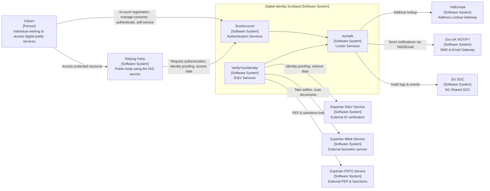

Understanding the ScotAccount architecture is essential for successful integration. This page provides an overview of system components, data flows, and integration points.

## System Overview

ScotAccount is part of the Digital Identity Scotland (DIS) ecosystem, providing centralised authentication and verified attribute services for Scottish Government digital services.

### High-Level Architecture

## Core Components

### ScotAccount (Authentication Services)

**Purpose**: Provides secure user authentication and session management

**Key Features**:

- OpenID Connect authentication provider
- User account management and registration
- Session handling and logout
- Multi-factor authentication support
- Consent management for data sharing

**Integration Points**:

- **Relying Parties**: Government services requiring authentication
- **Citizens**: User registration and authentication interface
- **mySafe**: Integration for verified attribute retrieval

### VerifyYourIdentity (ID&V Services)

**Purpose**: Handles identity verification processes to GPG45 Medium assurance level

**Key Features**:

- Document scanning and verification
- Biometric selfie capture and matching
- PEP (Politically Exposed Person) and sanctions checks
- Multi-step verification workflows
- Cross-device verification support

**External Dependencies**:

- **Experian ID&V**: Primary identity verification service
- **Experian Mitek**: Biometric verification and document scanning
- **Experian PEPS**: PEP and sanctions screening

### mySafe (Locker Services)

**Purpose**: Secure storage and management of verified user attributes

**Key Features**:

- Encrypted storage of verified identity data
- Address verification and lookup services
- Email verification and management
- Consent tracking for data sharing
- Audit logging for compliance

**External Dependencies**:

- **ViaEuropa**: Address lookup and verification
- **Gov.UK Notify**: SMS and email delivery services
- **SG SOC**: Security monitoring and audit logging

## Data Flow Patterns

### Basic Authentication Flow

1. **User Access Request**: Citizen attempts to access a protected resource
2. **Authentication Redirect**: Relying party redirects to ScotAccount
3. **User Authentication**: Citizen provides credentials to ScotAccount
4. **Token Generation**: ScotAccount generates and returns authentication tokens
5. **Resource Access**: Relying party validates tokens and grants access

### Verified Attribute Flow

1. **Attribute Request**: Relying party requests verified attributes with user consent
2. **Verification Check**: ScotAccount checks if verification is required
3. **Verification Process**: If needed, user is directed to VerifyYourIdentity
4. **Data Retrieval**: Verified attributes are retrieved from mySafe
5. **Attribute Delivery**: Verified data is securely provided to relying party

### Identity Verification Process

1. **Verification Initiation**: User starts identity verification in VerifyYourIdentity
2. **Document Capture**: User provides identity documents via Experian Mitek
3. **Identity Checks**: Documents verified against Experian ID&V database
4. **Biometric Verification**: Selfie capture and matching via Experian Mitek
5. **Sanctions Screening**: PEP and sanctions checks via Experian PEPS
6. **Result Storage**: Verification results stored securely in mySafe

## Security Architecture

### Authentication Security

- **OpenID Connect** standard implementation with PKCE
- **RSA 3072-bit or EC P-256** key pairs for client authentication
- **JWT tokens** with short expiration times
- **State parameter validation** for CSRF protection
- **Nonce verification** for replay attack prevention

### Data Protection

- **Encryption at rest** for all stored user data
- **TLS 1.3** for all data in transit
- **Zero-knowledge architecture** - ScotAccount doesn't store verification documents
- **Minimal data retention** with automated deletion policies
- **Consent-based data sharing** with granular user control

### Infrastructure Security

- **Cloud-native architecture** with built-in resilience
- **Security monitoring** via SG SOC integration
- **Penetration testing** and security audits
- **Compliance** with UK government security standards
- **Incident response** procedures and monitoring

## Integration Environments

### Integration Environment

- **Purpose**: Development and testing
- **Base URL**: `https://authz.integration.scotaccount.service.gov.scot`
- **Features**: Full feature set with test data
- **Limitations**: Not for production use

### Production Environment

- **Purpose**: Live service delivery
- **Base URL**: `https://authz.scotaccount.service.gov.scot`
- **Features**: Full production capabilities
- **Requirements**: Formal onboarding and security review

## Technical Standards

### Supported Standards

- **OpenID Connect 1.0** - Core authentication protocol
- **OAuth 2.0** - Authorization framework
- **RFC 7636 (PKCE)** - Security extension for public clients
- **RFC 7523** - JWT client assertion authentication
- **GPG45** - UK government identity verification standard

### Token Formats

- **ID Tokens**: JWT format with user identity claims
- **Access Tokens**: Opaque tokens for API access
- **Refresh Tokens**: Encrypted tokens for session extension

### Cryptographic Requirements

- **Signing Algorithms**: RS256, ES256
- **Key Lengths**: RSA 3072-bit minimum, EC P-256
- **Token Expiration**: 15 minutes for access tokens, 8 hours for sessions
- **Certificate Management**: Automatic rotation and validation

## Scalability and Performance

### Service Availability

- **99.9% uptime** target for production services
- **Load balancing** across multiple availability zones
- **Auto-scaling** based on demand
- **Disaster recovery** with data replication

### Performance Characteristics

- **Authentication latency**: < 500ms for standard flows
- **Throughput**: Supports high-volume government services
- **Caching**: Intelligent caching for improved response times
- **Monitoring**: Real-time performance tracking

## Compliance and Governance

### Regulatory Compliance

- **UK GDPR** compliance for data protection
- **Government Security Standards** adherence
- **Accessibility** compliance (WCAG 2.1 AA)
- **Open Government Licence** for documentation

### Audit and Monitoring

- **Comprehensive logging** of all authentication events
- **Real-time monitoring** via SG SOC integration
- **Regular security assessments** and penetration testing
- **Incident response** procedures and escalation

## Next Steps

<strong>Ready to implement?</strong> Review the <a href="/getting-started/">Getting Started guide</a> for step-by-step integration instructions.

<strong>Need detailed technical guidance?</strong> See the <a href="/scotaccount-complete-guide/">Complete Implementation Guide</a> for comprehensive technical details.

<strong>Planning token validation?</strong> Check out the <a href="/scotaccount-token-validation-module/">Token Validation Module</a> documentation.

